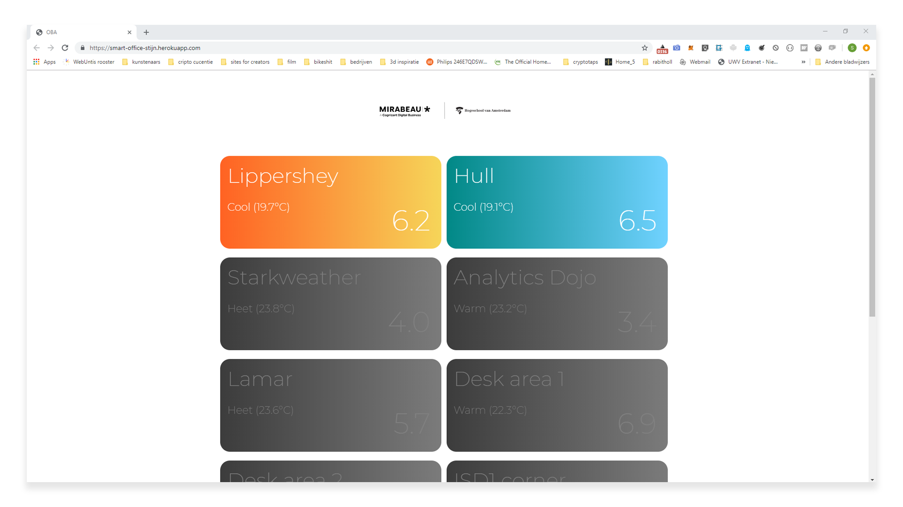
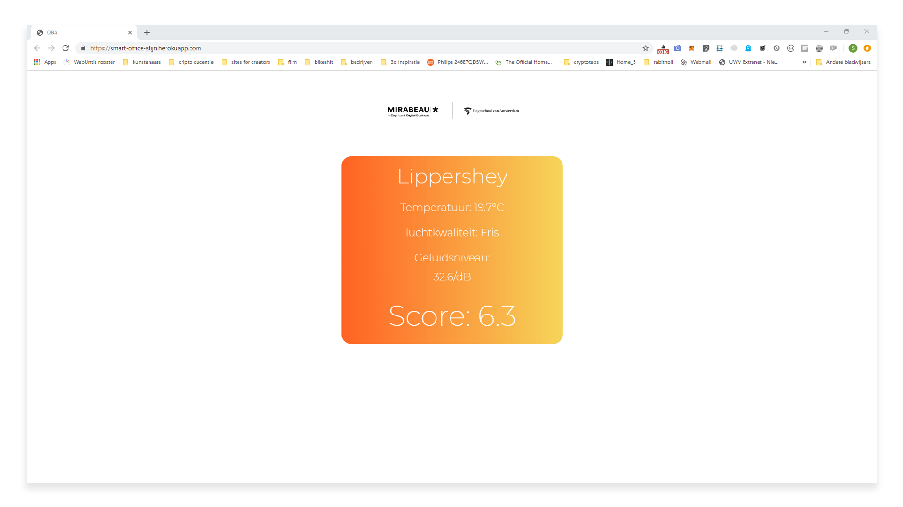
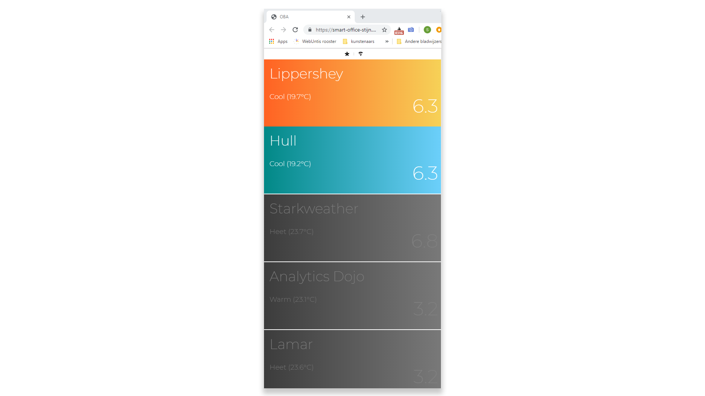
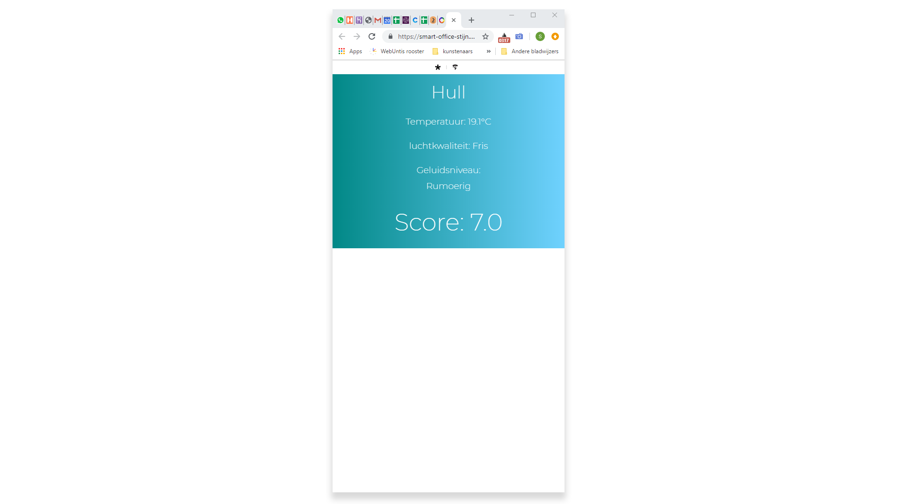

# Browser Technologies

## Case:
Ik heb tijdens de 3 weken browser technologies veel onderzocht en gewerkt aan mijn concept. Tijdens deze 3 weken heb ik gewerkt aan een quiz webapp. Door hier aan te werken begreep ik steeds beter waar deze weken over gingen maar door de keuzes die ik gemaakt had tijdens het bouwen heb ik de creteria niet kunnen halen maar wel kunnen begrijpen. Tijdens project 2 heb ik, nu met de juiste kennis, vanaf scratch opnieuw de principes van progresive enahncemant toegepast. 

Om het makkelijk te maken de ideale werkplek te vinden geeft deze app een overzicht met ruimtes die niet bezet zijn. Door de score te vergelijken kun je makkelijk vergelijken en keizen.

De webapp is volledig PE met CSS en JS fallbacks en doet het op zowel mobile als desktop sites.
De leesbaarheidsregels zijn toegepast, contrast en kleuren kloppen. De website is toetsenbordvriendelijk. De primaire kleuren zijn getest op https://color.review/ met een scoren van minimaal AA. De site werkt in alle browsers met de basis functionaliteiten. Met js word er voor gezorgt dat de ervaring overkomt als een onpage webapp en worden extra animaties toegevoegd. De CSS gradiants vallen terug op solide kleuren maar dit komt bijna niet voor omdat de css voor de meeste browsers die gradiants ondersteunen een eigen css lijn heeft. 

### Project 2
De ideale werkplek is goed voor de efficiëntie van alle werknemers. Vergaderruimtes zijn als ze niet gebruikt worden fijne ruimtes om in stilte te werken en het zou zonde zijn om deze ruimtes alleen voor vergaderingen te gebruiken. Om het makkelijk te maken om de ideale werkplek te vinden is het handig om in een oogopslag te zien waar die plek is. In dit overzicht staan alle ruimtes. Er is aangegeven tot hoe laat hij vrij is, wat de temperatuur is en of het rumoerig is of niet. Daarnaast is er ook een score toe gekend op basis van de licht, co2, luchtvochtigheid, temperatuur en geluid. Met deze informatie is het makkelijk te zien in welke ruimte het fijn is om te werken. De score is gebaseerd op de volgende formule Elke parameter heeft een ideale waarde. De huidige waarde wordt omgerekend tot een cijfer van 1 tot 10 met 5 als ideaal. Alle cijfers worden bij elkaar op gerekend en tot een eindcijfer gerekend met een exponentiële formule. Hierdoor kan een kamer met een temperatuur cijfer van 2 nooit een gemiddeld cijfer van 8 krijgen.

Focus is even een stapje terug.

Basis van html semantiek, media queries en PE

serverside versie met js overlay en css enhancements.

## 

